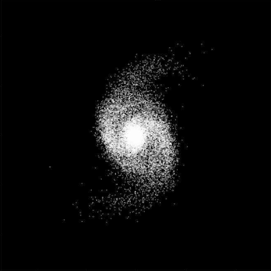
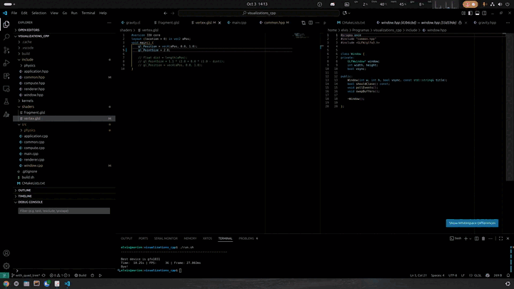

Hi there, I’m [Elvis Mello-Terencio](https://elvismello.github.io/) 👋

I'm an astrophysics PhD Student at Observatório Nacional in Rio de Janeiro, Brazil. My work has focused until recently on galaxy evolution, exploring how jellyfish galaxies are influenced by their environments, howerver, I am now expanding my research into gravitational lensing. I have a profound interest in data analysis and numerical simulations.

I maintain a few repositories related to astrophysics research in $N$-body simulations:

- [galstep](https://github.com/elvismello/galstep): Generates initial conditions for simulating disc galaxies. It can output in HDF5 and Gadget2 binary format, being able to run in any Gadget version, RAMSES and Arepo.
- [clustep](https://github.com/elvismello/clustep): Generates initial conditions for galaxy clusters, working similarly to [galstep](https://github.com/elvismello/galstep).
- [snapshotJoiner](https://github.com/elvismello/snapshotJoiner): Merges initial conditions either in Gadget2 or HDF5 formats.
- [snapshotJoinerMk2](https://github.com/elvismello/snapshotJoinerMk2): An upgraded version of [snapshotJoiner](https://github.com/elvismello/snapshotJoiner) that works exclusively with HDF5. This version provides improved merging logic.

Outside of these scripts, I also enjoy developing side projects that I find interesting, such as:

  
- [visualizations_cpp](https://github.com/elvismello/visualizations_cpp): *(In progress)* framework for quickly prototyping GPU kernels. Includes an out-of-the-box direct-sum gravity simulation of $\sim 10^{4.5}$ particles that runs in real time.
- [BurguersSolution](https://github.com/elvismello/BurgersSolution): Translation to C++ from Fortran of a differential equation solver from Eleuterio F. Toro's book for Numerical Methods.
- [simpleBilliards](https://github.com/elvismello/simpleBilliards): A simple 2d simulation of colliding circles.
  

